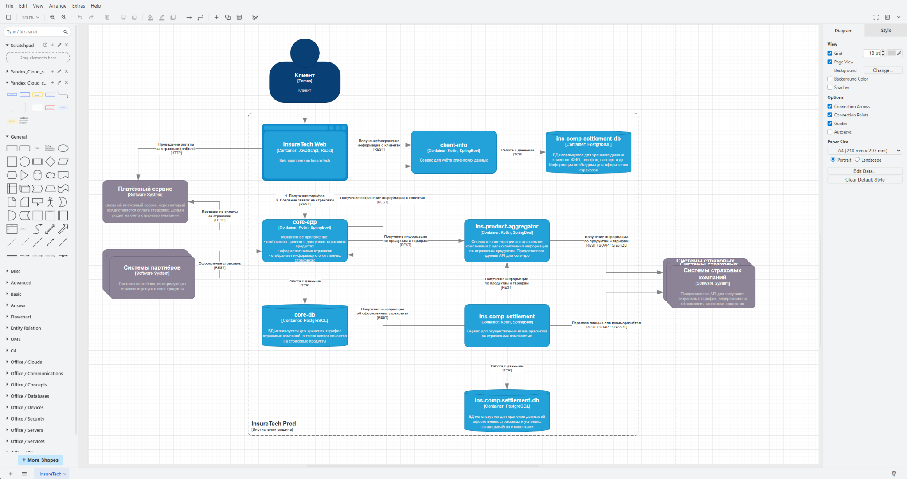
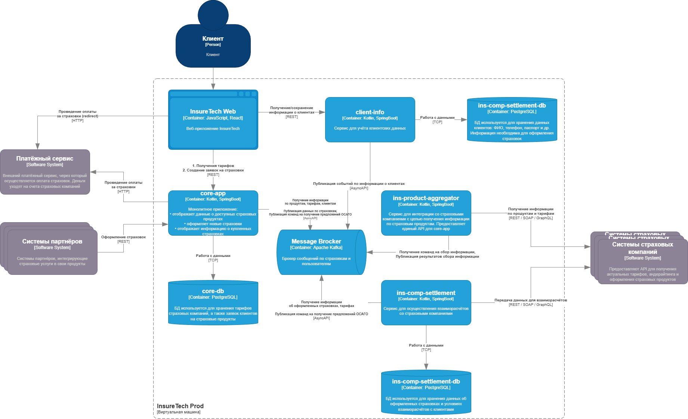

# Анализ проблем текущей архитектуры

Компания планирует подписать соглашение еще с 5 страховыми компаниями. Это значит, что время одного синхронного ответа будет увеличено. Раз ответ синхронный, это значит, что ответ предоставляется в рамках одного сетевого подключения. Это в свою очередь приведет к увеличению конкуренции core-app и ins-comp-settlement за сетевые подключения к ins-product-aggregator. В итоге при увеличении количества запросов, сервисы будут попадать в очередь на подключение, часть запросов будет "отваливаться" по таймауту. В описании взаимодействия указано, что core-app запрашивает данные раз в 15 минут для обновления данных по предложениям, а ins-comp-settlement обращается к этому сервису раз в месяц для составления рассчета выплаты агентских премий. Так же этот сервис занимается сбором предложений ОСАГО для конкретног автомобиля. Из чего можно сделать вывод, что даже у текущего количества пользователей  и парнерских сервисов появятся большие подвисания системы и учатятся ошибки.

"Бутылочным горлышком" текущего решения является core-app потомучто все взаимодействия со сторонними системами построены синхронно.

Для решения проблем нужно добавить асихронные взаимодействия. В первую очередь нужно переделать механизм репликации данных по клиентам и страховкам. 

В core-app добавим transactonal outbox для публикации событий об оформленных страховках. 
В client-info добавим transactonal outbox для публикации событий об изменении клиентских данных.

Взаимодействие с ins-product-aggregator переделаем на асинхронный подход: теперь будут публиковаться команды на сбор информации, а информация будет складываться в очередь и доставляться тому, кто запросил.

